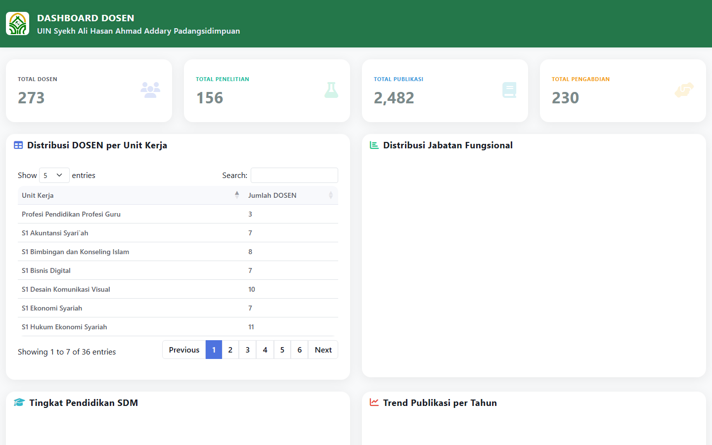
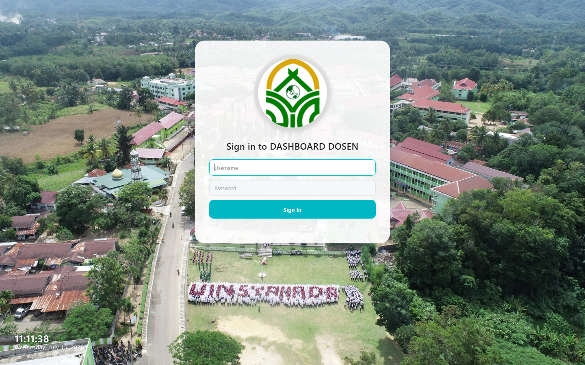
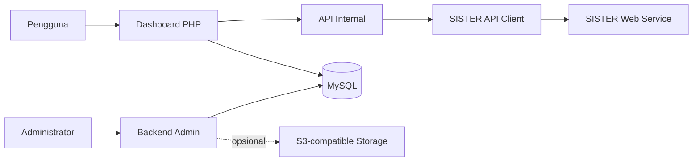

<div align="center">

# SISTER Dosen Dashboard

Dashboard web untuk memantau, mengelola, dan menyajikan data dosen dari **SISTER Web Service Perguruan Tinggi**.


</div>



## Tentang Aplikasi

SISTER Dosen Dashboard membantu perguruan tinggi melihat data SISTER dalam satu antarmuka yang lebih ringkas. Data SDM, tridharma, pendidikan, penugasan, dan referensi akademik dapat dicari, ditampilkan, dan disinkronkan ke database lokal.

Aplikasi terdiri dari dua bagian utama:

- **Dashboard SISTER** untuk statistik, pencarian SDM, detail dosen, dan visualisasi data akademik.
- **Backend Admin** untuk mengelola pengguna, role, menu, permission, referensi, dan pengaturan aplikasi.

## Fitur Utama

| Fitur | Keterangan |
| --- | --- |
| Autentikasi SISTER | Memperoleh Bearer token melalui endpoint `/authorize` |
| Dashboard statistik | Ringkasan SDM, penelitian, publikasi, pengabdian, dan pendidikan |
| Direktori SDM | Pencarian dan tampilan detail dosen atau tenaga kependidikan |
| Data tridharma | Penelitian, publikasi, pengabdian, dan aktivitas pendukung |
| Riwayat akademik | Pendidikan formal, penugasan, kepangkatan, dan jabatan fungsional |
| Referensi SISTER | Perguruan tinggi, unit kerja, semester, wilayah, dan bidang ilmu |
| Sinkronisasi lokal | Menyimpan data terpilih dari SISTER ke MySQL |
| Backend berbasis role | Menu dan hak akses dinamis untuk setiap kelompok pengguna |
| Impor dan ekspor | Pengolahan data administratif melalui berkas Excel |
| Object storage | Dukungan opsional untuk penyimpanan gambar berbasis S3-compatible |

## Tampilan Aplikasi

### Dashboard Utama

Dashboard menampilkan ringkasan data SDM dan tridharma, distribusi unit kerja, grafik akademik, serta akses cepat ke direktori dosen.

### Backend Admin

Backend admin menyediakan area pengelolaan data lokal, pengguna, kelompok akses, menu, role, dan konfigurasi aplikasi.



> Screenshot hanya memperlihatkan contoh tampilan aplikasi lokal. Data dosen dan credential tidak disertakan dalam repository.

## Modul Data

| Kelompok | Data yang ditampilkan |
| --- | --- |
| SDM | Identitas, status pegawai, NIDN, NIP, NUPTK, dan unit kerja |
| Data pribadi | Profil, alamat, kontak, keluarga, dan kepegawaian |
| Pendidikan | Pendidikan formal, gelar, dan riwayat studi |
| Penugasan | Ikatan kerja, unit kerja, dan riwayat penugasan |
| Penelitian | Judul, bidang ilmu, tahun, peran, dan durasi kegiatan |
| Publikasi | Judul, jenis publikasi, kategori, dan tanggal terbit |
| Pengabdian | Judul kegiatan, bidang ilmu, tahun, dan durasi |
| HKI | Hak cipta, paten, karya monumental, dan kategori kegiatan |
| Referensi | Semester, wilayah, bidang ilmu, unit, dan perguruan tinggi |

## Alur Kerja



1. Aplikasi meminta token akses ke layanan autentikasi SISTER.
2. Token digunakan oleh client internal untuk mengambil data melalui endpoint SISTER.
3. Data ditampilkan pada dashboard atau disimpan ke database lokal melalui proses sinkronisasi.
4. Backend admin mengelola data lokal dan pengaturan aplikasi sesuai permission pengguna.

## Teknologi

| Bagian | Teknologi |
| --- | --- |
| Backend | PHP native dengan framework/helper internal |
| Database | MySQL dan PDO |
| HTTP client | PHP cURL |
| Antarmuka admin | AdminLTE, Bootstrap, dan jQuery |
| Tabel dan editor | DataTables, CKEditor, dan KCFinder |
| Visualisasi | Highcharts, ApexCharts, dan Chart.js |
| Dependency manager | Composer |
| Object storage | AWS SDK untuk endpoint S3-compatible |
| Web server | Apache atau Nginx |

Proyek ini tidak menggunakan Laravel, CodeIgniter, atau Symfony. Routing, autentikasi lokal, dan modul backend menggunakan implementasi kustom.

## Struktur Utama

```text
sister-dosen-dashboard/
|-- index.php                 Router dashboard utama
|-- dashboard.php             Halaman dashboard
|-- detail_dosen.php          Detail SDM
|-- api.php                   API internal frontend
|-- auth/                     Autentikasi dan session SISTER
|-- includes/                 Client API dan helper aplikasi
|-- backend/                  Backend administrasi
|-- assets/                   CSS dan JavaScript dashboard
|-- db/                       Struktur database yang telah disanitasi
|-- docs/screenshots/         Gambar dokumentasi
|-- sinkron/                  Collector dan proses sinkronisasi
`-- wsv1.yaml                 Spesifikasi OpenAPI SISTER
```

## Data dan Privasi

Repository versi open-source dirancang agar tidak menyertakan data pribadi maupun credential aktif:

- Dump database hanya mempertahankan struktur dan data referensi umum.
- Data dosen, pendidikan, penelitian, publikasi, pengabdian, dan HKI tidak disertakan.
- Token, credential API, secret object storage, dan akun pengguna lama tidak disertakan.
- Screenshot dokumentasi tidak boleh memuat data dosen atau informasi rahasia.

Data yang diperoleh dari endpoint pribadi SISTER harus diperlakukan sebagai data terbatas dan tidak boleh dimasukkan ke repository, log publik, ataupun dokumentasi terbuka.

## Catatan Proyek

- Backend menggunakan framework internal/legacy.
- Beberapa komponen lama masih dipertahankan untuk kompatibilitas.
- Konfigurasi keamanan perlu disesuaikan kembali sebelum penggunaan di lingkungan produksi.
- Lisensi open-source belum ditetapkan dan perlu disesuaikan dengan kebijakan institusi.

## Referensi

- [Dokumentasi SISTER Web Service](https://sister-api.kemdiktisaintek.go.id/ws.php/1.0)
- [Spesifikasi OpenAPI SISTER](wsv1.yaml)
