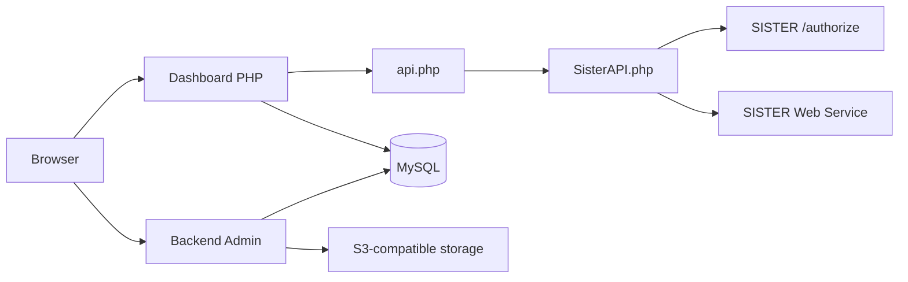

# SISTER Dosen Dashboard

Dashboard web untuk menampilkan, mengelola, dan menyinkronkan data dosen dari **SISTER Web Service Perguruan Tinggi**. Aplikasi dibangun dengan PHP native, MySQL, backend admin kustom, dan antarmuka berbasis AdminLTE.

> Petunjuk pemasangan dan konfigurasi tersedia terpisah di [howtoinstall.md](howtoinstall.md).

## Screenshots

### Dashboard Utama


Dashboard utama menyajikan ringkasan SDM, penelitian, publikasi, pengabdian, distribusi unit kerja, dan visualisasi data akademik.

### Login Backend Admin


Backend admin menyediakan area pengelolaan data, referensi, pengguna, menu, role, dan pengaturan aplikasi.

> Gambar hanya memperlihatkan contoh tampilan aplikasi lokal. Data dosen dan credential tidak disertakan dalam dump open-source.

## Tentang Aplikasi

SISTER Dosen Dashboard membantu perguruan tinggi menyajikan data SISTER dalam tampilan yang lebih ringkas dan mudah dipantau. Aplikasi memiliki dua area utama:

### Dashboard SISTER

- Menampilkan statistik SDM dan tridharma.
- Menyajikan daftar serta detail dosen.
- Mengambil data penelitian, publikasi, pengabdian, pendidikan, penugasan, dan HKI.
- Menampilkan distribusi unit kerja, jabatan fungsional, dan pendidikan.
- Menggunakan token SISTER untuk mengakses Web Service resmi.

### Backend Admin

- Mengelola pengguna dan kelompok akses lokal.
- Mengatur menu serta permission berdasarkan role.
- Mengelola data referensi dan data hasil sinkronisasi.
- Menyediakan fitur impor/ekspor Excel.
- Mengatur identitas serta tampilan aplikasi.
- Mendukung penyimpanan gambar melalui layanan S3-compatible.

## Fitur Utama

| Fitur | Keterangan |
|---|---|
| Autentikasi SISTER | Meminta Bearer token melalui endpoint `/authorize` |
| Dashboard statistik | Ringkasan SDM, penelitian, publikasi, dan pengabdian |
| Direktori SDM | Pencarian dan detail dosen/tenaga kependidikan |
| Tridharma | Penelitian, publikasi, pengabdian, dan aktivitas pendukung |
| Data pribadi | Profil, alamat, kepegawaian, pendidikan, dan penugasan |
| Referensi SISTER | Perguruan tinggi, unit kerja, semester, wilayah, dan referensi lainnya |
| Sinkronisasi lokal | Menyimpan data terpilih dari SISTER ke MySQL |
| Backend berbasis role | Menu dan permission dinamis untuk pengguna lokal |
| Google Custom Search | Integrasi opsional untuk informasi SINTA/Google Scholar |
| Object storage | Integrasi opsional dengan endpoint S3-compatible |

## Teknologi

| Bagian | Teknologi |
|---|---|
| Backend | PHP native dan framework/helper internal |
| Database | MySQL, PDO |
| Dependency manager | Composer |
| HTTP client | PHP cURL |
| Admin UI | AdminLTE, Bootstrap, jQuery |
| Tabel dan editor | DataTables, CKEditor, KCFinder |
| Grafik | Highcharts, ApexCharts, Chart.js |
| Object storage | AWS SDK untuk endpoint S3-compatible |
| Web server | Apache atau Nginx |

Proyek ini bukan Laravel, CodeIgniter, atau Symfony. Routing, autentikasi lokal, dan modul backend menggunakan implementasi kustom.

## Arsitektur



### Alur Integrasi SISTER

1. Aplikasi mengirim credential Web Service ke `/authorize`.
2. SISTER mengembalikan Bearer token dan role.
3. Token disimpan dalam session aplikasi dengan batas waktu tertentu.
4. `SisterAPI.php` memakai token untuk meminta data pada endpoint SISTER.
5. Data ditampilkan langsung atau disimpan ke database lokal melalui proses sinkronisasi.

`id_pengguna` digunakan untuk autentikasi Web Service, sedangkan `id_sdm` mengidentifikasi dosen atau tenaga kependidikan pada endpoint data.

## Modul Data

| Kelompok | Contoh data |
|---|---|
| SDM | Identitas, status pegawai, NIDN, NIP, dan NUPTK |
| Data pribadi | Profil, alamat, kontak, keluarga, dan kepegawaian |
| Pendidikan | Pendidikan formal, gelar, dan riwayat studi |
| Penugasan | Unit kerja, ikatan kerja, dan riwayat penugasan |
| Penelitian | Judul, bidang ilmu, tahun, dan durasi kegiatan |
| Publikasi | Judul, jenis publikasi, kategori, dan tanggal terbit |
| Pengabdian | Judul kegiatan, bidang ilmu, tahun, dan durasi |
| HKI | Hak cipta, paten, karya monumental, dan kategori kegiatan |
| Referensi | Semester, wilayah, bidang ilmu, unit, dan perguruan tinggi |

## API Internal

Frontend berkomunikasi dengan `api.php` menggunakan parameter `action`. Endpoint internal ini memerlukan session SISTER yang aktif.

| Action | Fungsi |
|---|---|
| `sdm` | Mengambil daftar dan pencarian SDM |
| `unit_kerja` | Mengambil daftar unit kerja |
| `referensi` | Mengambil data referensi berdasarkan tipe |
| `profil_pt` | Mengambil profil perguruan tinggi |
| `jabatan_fungsional` | Mengambil jabatan fungsional SDM |
| `penelitian` | Mengambil data penelitian |
| `publikasi` | Mengambil data publikasi |
| `pengabdian` | Mengambil data pengabdian |
| `pendidikan_formal` | Mengambil pendidikan formal |
| `data_pribadi` | Mengambil kelompok data pribadi SDM |
| `semester` | Mengambil referensi semester |
| `dashboard_stats` | Menyediakan statistik dashboard |

## Struktur Proyek

```text
sister-dosen-dashboard/
├── index.php                     # Router dashboard utama
├── dashboard.php                 # Halaman dashboard
├── detail_dosen.php              # Detail SDM
├── api.php                       # API internal frontend
├── auth/                         # Autentikasi dan session SISTER
├── includes/
│   ├── SisterAPI.php             # Client SISTER Web Service
│   ├── AuthHelper.php            # Helper autentikasi
│   ├── config-example.php        # Template konfigurasi SISTER
│   └── sinta.php                 # Integrasi pencarian dan cache
├── backend/
│   ├── index.php                 # Router backend admin
│   ├── inc/                      # Konfigurasi, helper, dan library
│   ├── modul/                    # Modul backend dinamis
│   └── assets/                   # Tema dan plugin backend
├── assets/                       # CSS dan JavaScript dashboard
├── db/sister_api.sql             # Dump database yang disanitasi
├── docs/screenshots/             # Gambar dokumentasi
├── sinkron/                      # Collector data tambahan
├── sync_sister_data.php          # Sinkronisasi utama
├── sync_data_pribadi.php         # Sinkronisasi data pribadi
├── wsv1.yaml                     # Salinan OpenAPI SISTER
└── howtoinstall.md               # Instalasi dan konfigurasi
```

## Data dan Privasi

Dump database dalam repository telah disanitasi untuk kebutuhan open-source:

- Struktur tabel dan data referensi umum tetap tersedia.
- Data dosen, pendidikan, penugasan, penelitian, publikasi, pengabdian, dan HKI tidak disertakan.
- Token, akun pengguna lama, credential Google, dan secret object storage tidak disertakan.
- File konfigurasi aktif diabaikan Git; repository hanya menyimpan template tanpa credential.

Data yang diperoleh dari endpoint pribadi SISTER harus diperlakukan sebagai data terbatas dan tidak boleh dimasukkan ke repository, log publik, atau screenshot dokumentasi.

## Keterbatasan Saat Ini

- Backend memakai framework internal/legacy.
- Password backend masih menggunakan MD5 untuk kompatibilitas kode lama.
- Verifikasi sertifikat TLS pada client cURL masih perlu diperketat untuk production.
- Sebagian statistik dashboard masih memiliki nilai demonstrasi.
- Beberapa collector lama di folder `sinkron` memerlukan pemeriksaan path sebelum digunakan.
- Modul Excel lama memiliki beberapa file yang belum kompatibel penuh dengan PHP terbaru.

## Dokumentasi

- [Panduan instalasi dan konfigurasi](howtoinstall.md)
- [Dokumentasi interaktif SISTER Web Service](https://sister-api.kemdiktisaintek.go.id/ws.php/1.0)
- [OpenAPI SISTER Web Service](wsv1.yaml)

## Lisensi

Belum ada file lisensi eksplisit. Tentukan lisensi open-source yang sesuai dengan kebijakan institusi sebelum repository dipublikasikan.
# sister-dosen-dashboard

# sister-dosen-dashboard

